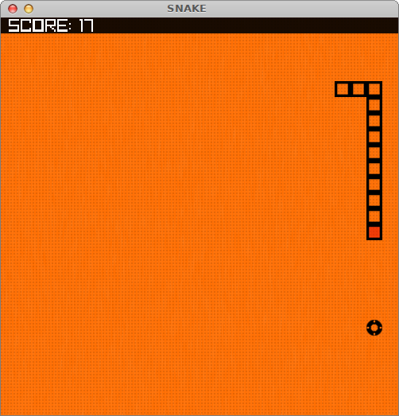

# SNAKE

Based on Gtk [example](www.opita.net/node/876) and ported to [Raylib](www.raylib.com) version 3.7.

At the moment it's a training example. It shows how to use pointers and dynamic data.
Published as is, with the hope of finishing.

Compile on Linux:

	gcc -o Snake snake.c -lraylib -lglfw -lGL -lm -lpthread -ldl -lrt -lX11 
